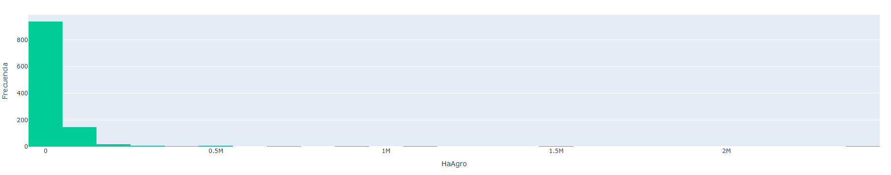
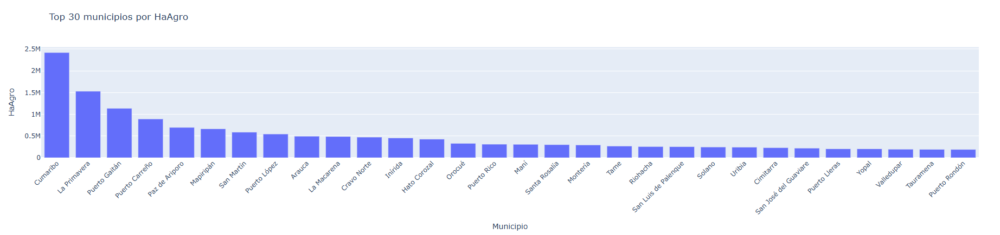
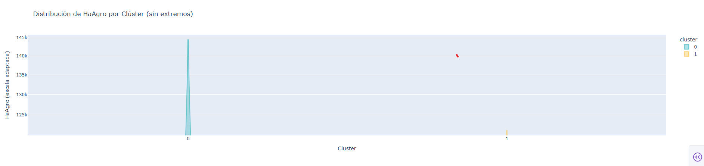

# Análisis del Uso y Tenencia de la Tierra

Este proyecto analiza cómo se distribuye la tierra y los regímenes de tenencia en zonas rurales dispersas.

## 📄 Descripción del dataset

Fuente oficial:  
https://www.datos.gov.co/dataset/Censo-Nacional-Agropecuario-Uso-de-la-tierra/f9jj-yx8h/about_data

- **Distribución de coberturas y usos del suelo:**
  - `HaNatura`: Hectáreas con cobertura natural.
  - `HaAgro`: Hectáreas con uso agropecuario.
  - `HanoAgro`: Hectáreas con uso no agropecuario.
  - `HaOtro`: Hectáreas con otros usos.

- **Régimen de tenencia de la tierra:**
  - `PrPropia`: Tierra en propiedad propia.
  - `PrArrien`: Tierra en arriendo.
  - `PrAparce`: Tierra en aparcería.
  - `PrUsufru`: Tierra en usufructo.
  - `PrComoda`: Tierra en comodato.
  - `PrOcupac`: Tierra ocupada de hecho.
  - `PrColect`: Propiedad colectiva.
  - `PrAdjudi`: Adjudicatario comunero.
  - `PrOtros`: Otras formas de tenencia.
  - `PrMixta`: Tenencia mixta.

- **Unidades de producción:**
  - `UPA`: Número de Unidades de Producción Agropecuaria.
  - `UPNA`: Número de Unidades de Producción No Agropecuaria.

- **Variables geográficas:**
  - `DPTO`, `MPIO`: Departamento y municipio.
  - `LATITUDE`, `LONGITUDE`, `ELEVATION`: Datos geográficos.
  - `cluster`: Agrupación de municipios según características de uso y tenencia.

## 🖼️ Gráficas del Análisis

### 📊 Histograma - Distribución de hectáreas agropecuarias


---

### 🏙️ Top 30 municipios según uso agropecuario


---

### 🎯 Distribución por Clúster (Violin Plot)


---

## 📊 Guía para interpretar las gráficas del dashboard

### 1. **Histograma**
- Muestra la frecuencia con que aparecen distintos rangos de valores de una variable (por ejemplo, hectáreas agropecuarias).
- Útil para detectar si los datos están concentrados en rangos bajos o si hay valores extremos.

### 2. **Gráfico de Barras (Top 30 municipios)**
- Ordena los municipios con mayor valor en la variable seleccionada.
- Ideal para comparar regiones de forma clara y directa.

### 3. **Gráfico por Clúster (Violin Plot)**
- Compara la distribución de una variable según grupos de clúster.
- Se puede ver la forma, la mediana, la variabilidad y si hay acumulación.
- Se filtran los valores más extremos (percentil 95) para una mejor visualización.

---

## 📌 Ejemplo de interpretación

- **Cluster 2**: Municipios con más hectáreas agropecuarias. Mediana > 1 millón de ha.
- **Cluster 1**: Municipios más homogéneos en superficie productiva.
- **Cluster 0**: Mayor diversidad en los tipos de tenencia.

---

## 🎯 Aplicaciones del análisis

- Identificar regiones con potencial de desarrollo agropecuario.
- Aplicar políticas diferenciadas según características territoriales.
- Detectar acumulación o concentración de tierra.

## ⚙️ Instrucciones de ejecución

### 1. Instalar dependencias
```bash
pip install pandas matplotlib seaborn scikit-learn plotly dash
```

### 2. Ejecutar análisis por etapas
```bash
python 1_analisis_exploratorio.py
python 2_limpieza_datos.py
python 3_modelo_clustering.py
python 4_visualizaciones.py
```

### 3. Ejecutar dashboard interactivo
```bash
python 5_dashboard_agro.py
```

Esto abrirá una interfaz en el navegador donde se pueden explorar variables por municipio, departamento y clúster.
